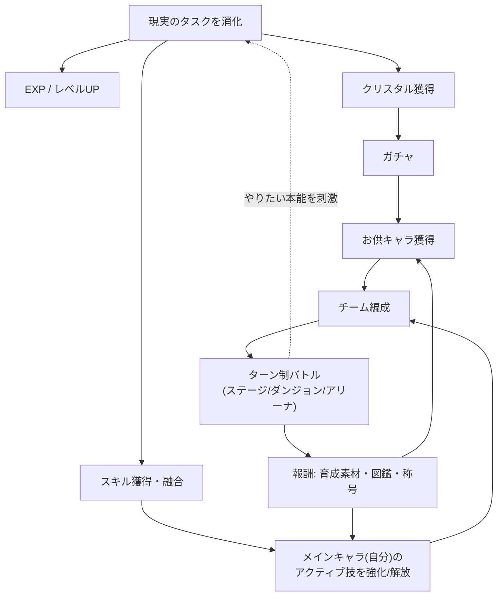
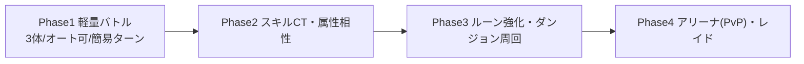
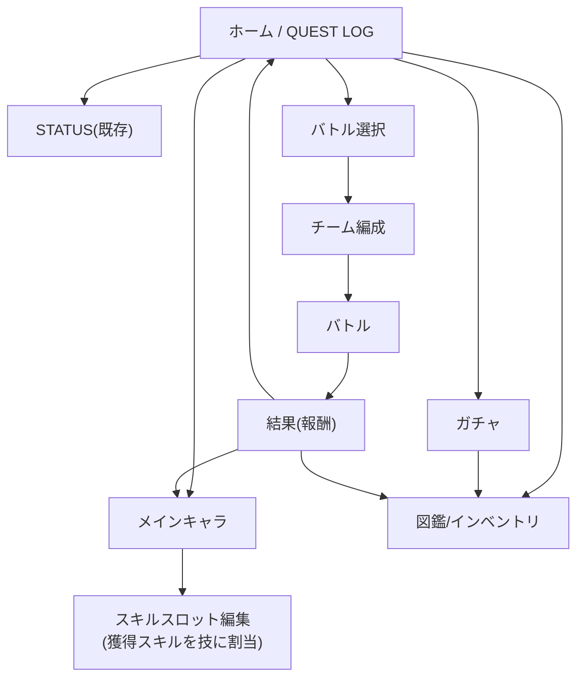
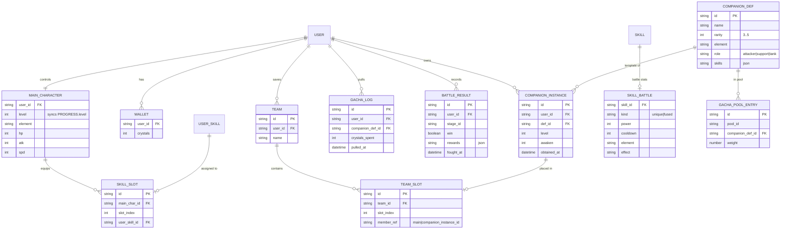
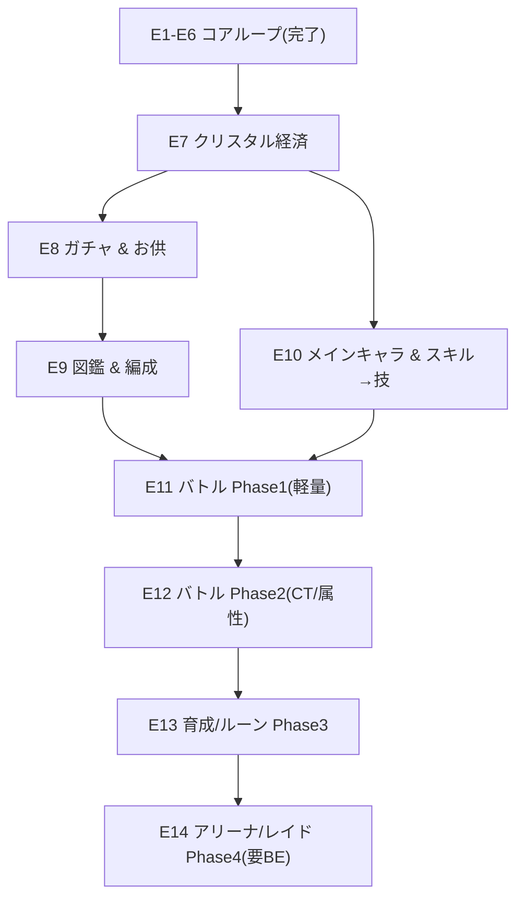

# LifeQuest 拡張設計書 — ガチャ＆バトル層（サマナーズウォー型）

> 本書は [lifequest-design.md](lifequest-design.md)（コア設計）の**将来拡張**を具体化したもの。
> 初期スコープ（タスク消化→成長ループ）の完成を前提に、その上へ積む RPG レイヤーを定義する。
> 方針: **① 今回は設計・ロードマップ化（実装は段階的） / ② バトルは段階導入 / ③ 獲得スキルはメインキャラのアクティブ技として使用**。

---

## 0. 概要

LifeQuest のコアループ（タスク消化 → EXP/レベル → スキル獲得 → 融合）に、**サマナーズウォー型の収集・編成・ターン制バトル**を接続する拡張。
最大の発明は通貨設計で、ガチャの資源「**クリスタル**」を**現実のタスク消化で稼ぐ**点にある。現実で動くほどゲーム資源・戦力が増えるため、"やりたい本能" の報酬が「収集・編成・バトル」という新しい遊びへ流れ込み、継続動機を強化する。

3つの柱:
1. **メインキャラ＝自分**: ユーザー本人とリンクした唯一無二のキャラ。タスクで得た**固有/融合スキルがそのままバトルのアクティブ技**になる。
2. **お供キャラ（サモン）**: クリスタルガチャで入手する仲間。チームを編成して共に戦う。
3. **クリスタル経済**: 課金ではなく**行動で稼ぐ**。現実の達成がガチャ・育成の燃料になる。

---

## 1. ゲームデザイン

### 1.1 拡張後のコアループ

要点: **現実の行動 → ゲーム資源/戦力**は一方向。ゲームを進めたい欲求が現実のタスク着手を引っ張る（逆流＝行動の動機化）。

### 1.2 設計原則（拡張固有）
- **現実が唯一の通貨源**: クリスタルは原則タスク消化でのみ増える（初期は課金導入しない）。"動かないと強くなれない" を守る。
- **自分が主役**: メインキャラはガチャ対象外。スキルは現実の達成でしか伸びない＝自己効力感に直結。
- **段階的な複雑さ**: バトルは軽量から始め、ルーン/属性/アリーナを後追加（1.5 参照）。
- **世界観の一貫**: Extreme Action & Solid Pop を踏襲（斜め・ソリッド・黄/シアン/マゼンタ、No Blur）。

---

## 2. ゲームシステム定義

### 2.1 メインキャラ（自分リンク）
- ユーザーにつき1体。**LV はユーザーレベル（コアの `LV`）と同期**。HP/攻撃などの基礎ステータスは LV から算出。
- **装備スキルスロット**: 獲得したタスクスキルから最大 N 個（初期 N=4）を「アクティブ技」としてセット。
- 属性（後述フェーズ）: メインキャラは1属性を持つ（初期は無属性 or 任意選択）。

### 2.2 スキル連携（獲得スキル → アクティブ技）★中核
タスクで得たスキルを、そのままバトルの技に変換する。スキル定義をデータ駆動で「技ステータス」に対応づける。

| 元スキル | 由来 | バトルでの役割（例） |
| :--- | :--- | :--- |
| 固有スキル（BOSS討伐） | 例: フロントエンド構築 | **通常アクティブ技**（CTあり）。属性/威力はスキル設定で定義 |
| 融合スキル | 例: フルスタック開発者 | **必殺技（Ultimate）**。長CT・高威力・特殊効果 |

- スキルマスタを拡張: `{ id, name, kind:"unique|fused", power, cooldown, effect, element }`。
- 技の威力は、由来クエストの EXP 値や融合段階を初期パラメータに利用可能（バランス用の係数はデータ駆動）。
- 新スキル獲得＝新技解放。融合＝上位技へ進化（演出は既存の 5.1/5.2 を流用）。

### 2.3 お供キャラ（サモン / モンスター）
- ガチャで入手。レアリティ ★3〜★5（SW準拠の段階）。
- 各お供は固有のアクティブ技セット（2〜3技）と属性を持つ。
- 重複入手は「進化素材／覚醒素材」に変換（ダブり救済）。
- 図鑑（Collection）で獲得状況・ステータスを一覧。

### 2.4 クリスタル経済
- **入手**: タスク完了で付与。`通常クエスト=少 / BOSS=多 / 融合=ボーナス / ストリーク継続=日次ボーナス / レベルUP=ボーナス`。
- **用途**: ガチャ（お供召喚）、育成素材交換、スタミナ回復（バトル周回, 後段）。
- 課金は初期スコープ外（将来、時短/スキンなど非Pay-to-Win方向で検討）。
- 経済初期値は §5 に提示（要実データ調整）。

### 2.5 ガチャ
- **対象はお供キャラのみ**（メインキャラは出ない）。
- レート例（★5:3% / ★4:22% / ★3:75%）＋**天井（ピティ）**（例: 100連で★5確定）。
- 単発／10連（10連は★4以上1体保証）。
- 演出は既存のソリッド演出資産（カットイン/フラッシュ）を流用しレアリティ別に強度を変える。
- **乱数の公正性**: シード/履歴をローカル保存。確率は明示（射幸性配慮、§7）。

### 2.6 チーム編成
- 1チーム＝**メインキャラ + お供（初期2体 → 段階的に最大4体）**。
- 属性・役割（アタッカー/サポート/タンク）を意識した編成。
- 編成はプリセット保存可（複数編成）。

### 2.7 バトル（段階導入）
ターン制。フェーズで段階的に拡張する。

- **Phase1（最初の実装）**: メイン+お供2の3体編成、敵ウェーブ、オート/手動の簡易ターン、HP/攻撃/速度のみ。スキルはCTなしor固定。報酬=クリスタル/素材。
- **Phase2**: スキルにクールタイム（CT）、属性相性（火/水/風/光/闇など）、行動順は速度依存。
- **Phase3**: ルーン（装備）による強化、ステージ/ダンジョン周回、スタミナ。
- **Phase4**: アリーナ（非同期PvP）、レイド/協力（要バックエンド）。

### 2.8 育成・強化
- お供のレベルアップ（バトル/素材）、覚醒（ダブり活用）、ルーン装着（Phase3）。
- メインキャラは**現実の成長でのみ強化**（LV同期＋スキル解放/融合）。育成素材では伸ばさない＝一貫性。

---

## 3. 画面設計・遷移（拡張分）

### 3.1 追加画面
| 画面 | 役割 |
| :--- | :--- |
| ホーム（拡張） | 既存 QUEST LOG に「クリスタル所持数」「バトルへ」導線を追加 |
| キャラ（メインキャラ） | メインキャラのステータス・装備スキルスロット編集 |
| ガチャ | クリスタル消費でお供召喚（単発/10連）＋演出 |
| 図鑑 / インベントリ | 獲得お供・スキル・素材の一覧 |
| チーム編成 | メイン＋お供のパーティ編成・プリセット |
| バトル選択 | ステージ/ダンジョン/アリーナの選択（フェーズで解放） |
| バトル画面 | ターン制戦闘の実行 |
| 結果 | 報酬（クリスタル/素材/図鑑更新） |

### 3.2 遷移図

---

## 4. データモデル拡張

既存（USER/PROGRESS/QUEST/SKILL/USER_SKILL/FUSE_RECIPE）に以下を追加。

- **MAIN_CHARACTER.level** は `PROGRESS.level` と同期（別管理せず参照）。
- **SKILL_BATTLE** は既存 SKILL を戦闘用に拡張するサイドテーブル（コアのスキル定義は壊さない）。
- お供は `COMPANION_DEF`(マスタ) と `COMPANION_INSTANCE`(所持) を分離（SW同様、ダブり/覚醒に対応）。

---

## 5. 経済バランス初期値（要調整・データ駆動）

すべて設定値として外出しし、プレイデータで調整する前提。

| 項目 | 初期値（案） |
| :--- | :--- |
| 通常クエスト完了 | +5 クリスタル |
| BOSSクエスト完了 | +30 クリスタル |
| 融合成功 | +50 クリスタル |
| ストリーク継続(日次) | +連続日数×2 クリスタル |
| レベルアップ | +20 クリスタル |
| ガチャ単発 | 50 クリスタル |
| ガチャ10連 | 450 クリスタル（★4以上1体保証） |
| 排出レート | ★5:3% / ★4:22% / ★3:75% |
| 天井(ピティ) | 100連で★5確定（カウンタ保存） |

> 目安: 1日にデイリー4＋BOSS1をこなすと ≒ 50/日 → 約1日1単発。継続が回るペースを基準に微調整。

---

## 6. 段階的ロードマップ

コア（E1〜E6, 実装済み）に続く拡張エピックとして定義。各エピックは後でストーリー票（[lifequest-stories.md](lifequest-stories.md)）へ分解する。

| エピック | 内容 | 主な依存 | 規模感 |
| :--- | :--- | :--- | :--- |
| **E7 クリスタル経済** | WALLET、タスク報酬でクリスタル付与、所持表示、永続化 | コア | M |
| **E8 ガチャ & お供** | COMPANION_DEF、ガチャ確率/天井、召喚演出、所持反映 | E7 | L |
| **E9 図鑑 & 編成** | 図鑑/インベントリ、チーム編成（プリセット） | E8 | M |
| **E10 メインキャラ & スキル→技** | MAIN_CHAR、SKILL_BATTLE、スキルスロット編集 | コア(スキル) | M |
| **E11 バトル Phase1** | 3体編成・簡易ターン・オート・報酬 | E9, E10 | L |
| **E12 バトル Phase2** | スキルCT・属性相性・速度順行動 | E11 | L |
| **E13 育成/ルーン Phase3** | お供育成・覚醒・ルーン・ダンジョン/スタミナ | E12 | L |
| **E14 PvP/レイド Phase4** | アリーナ(非同期)・協力。**バックエンド導入が必要** | E13 | XL |

> 推奨着手順: **E7 → E10 → E8 → E9 → E11**。
> 先に「クリスタルが貯まる実感(E7)」と「自分のスキルが技になる手応え(E10)」を出すと、ガチャ/バトルの価値が立ちやすい。

---

## 7. リスク・留意点

| 区分 | リスク / 留意点 | 対応方針 |
| :--- | :--- | :--- |
| スコープ膨張 | SW型は機能が巨大。一気に作ると未完で破綻 | フェーズ厳守。各 Phase 単体で遊べる状態を保つ |
| 射幸性/健全性 | ガチャは射幸性を伴う。現実の健全な習慣形成が目的 | 課金なし(現実通貨のみ)、確率明示、天井あり、煽り過多を避ける |
| 本末転倒 | バトル周回が目的化し、現実タスクが手段に堕ちる | クリスタル源を現実行動に限定。周回スタミナも現実報酬と紐付け |
| バランス | クリスタル付与/排出/威力の調整が難しい | 全て設定値で外出し、データ駆動。プレイログで調整 |
| 技術(PvP/同期) | Phase4 はローカル完結を超える | E14 でバックエンド(Supabase等)導入。それ以前はローカルで完結 |
| 公平性(乱数) | ガチャ乱数の信頼性・履歴 | シード/履歴/天井カウンタを永続化、検証可能に |
| データ移行 | コアのスキーマに大幅追加 | スキーマ version 管理＋マイグレーション(コア設計準拠) |

---

## 8. 既存設計との接続

- **通貨源の一本化**: クリスタルはコアの「タスク完了」イベントにフックして付与（`gainExp` と同じ choke point に `gainCrystals`）。
- **スキルの再利用**: コアの `SKILL`/`FUSE_RECIPE` をそのまま戦闘技の元データに使う（SKILL_BATTLE で拡張）。重複定義を作らない。
- **レベル同期**: メインキャラ LV は `PROGRESS.level` を参照。二重管理しない。
- **演出資産の流用**: ガチャ/技発動の演出は既存のソリッド演出（5.1/5.2）を拡張して使う。
- **データ駆動の継続**: EXP曲線/融合レシピと同様、クリスタル経済・ガチャ確率・技ステータスも設定で外出し。

> 本書は方向性の確定とロードマップ化が目的。実装は E7 以降をストーリー化してから着手する。
