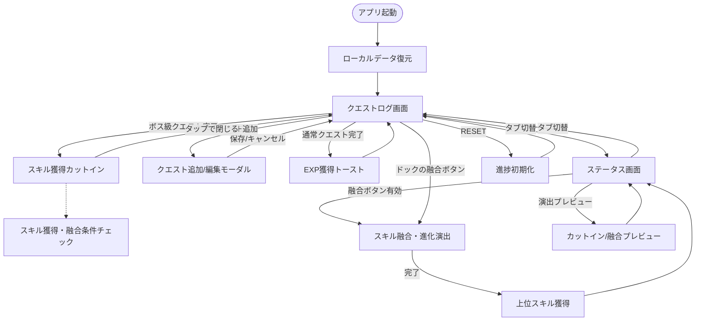
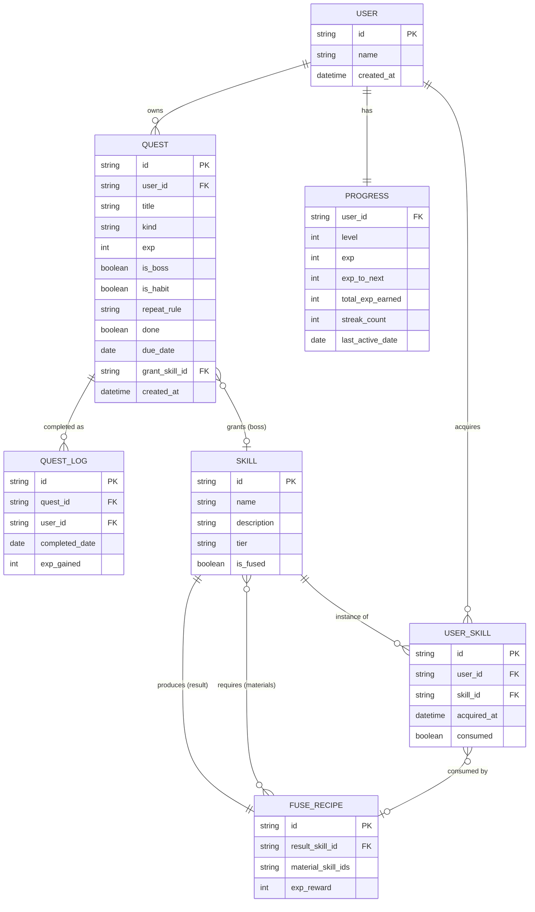
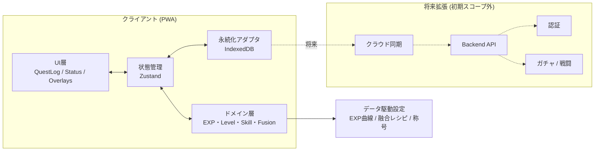

# LifeQuest 設計書一式

> タスク管理 × ファンタジーRPG。「頭でわかっていても、動けない」を終わらせるための行動科学的タスク管理アプリ。
> デザインシステム: **Extreme Action & Solid Pop**

---

## 0. プロダクト概要

**LifeQuest（ライフクエスト）** は、日々のタスクや習慣（運動・学習・読書など）の消化を、ファンタジーRPGの「育成ループ」に変換するタスク管理アプリである。ユーザーは「やるべき」と理性で分かっていても本能的に「やりたい」とは思えず、着手が後回しになり継続できないという課題を抱えている。LifeQuest は、タスク完了 → 経験値獲得 → レベルアップ → スキル獲得 → スキル融合による上位スキルへの進化、という即時かつ視覚的なフィードバックループによって、「やるべき」を「やりたい」へと接続する。

アプリを開けば即「今日のクエスト」が目に入り、最初の1つに手をつけやすい（着手ハードルの低減）。完了するたびに EXP・ステータス・スキルが目に見えて伸び、ボス級タスクの達成では全画面のカットイン演出で「固有スキル獲得」、複数スキルが揃えば「スキル融合（進化）」のパキッとしたソリッド演出が走る。気合や根性ではなく、システムが本能を動かして「次もやりたい」を生み出すことが本プロダクトの核である。ガチャ・戦闘などは将来拡張とし、初期スコープは「タスク消化 → 成長の実感」ループの完成に集中する。

---

## 1. 要件定義書

### 1.1 背景・解決する課題

- **課題**: 人は「やるべき（理性）」と「やりたい（本能）」が揃ったときに自発的に動ける。しかし日々のタスクや習慣タスクは「やるべき」と分かっていても本能的に「やりたい」になりにくく、着手が後回しになる／始めても続かない。**「理性は納得しているのに本能が動かず、着手・継続できない」状態**が解決対象。
- **なぜ重要か**: 着手・継続ができないと習慣が積み上がらずスキルも伸びず、「今日も何も進まなかった」という手応えのなさが自己効力感を下げる。続けた行動が達成感として返ってくる仕組みがあれば、「今日もできた」を日々積み重ね、その先でスキル向上にもつなげられる。

### 1.2 目的・ゴール

| 区分 | 内容 |
| :--- | :--- |
| 着手ハードルの低減 | アプリを開いた瞬間に「今日のクエスト」が目に入り、最初の1つに手をつけられる |
| 即時フィードバック | 完了するたびに EXP・レベル・ステータスが目に見えて伸びる |
| 継続の動機化 | 「レベルが上がった」「スキルを獲得した」という本能的報酬で「次もやりたい」を生む |
| 成長の手応え | スキル同士が融合して上位スキルへ進化する“育成”の楽しさ |
| 一貫した世界観 | タスク管理 × ファンタジーRPG を Extreme Action & Solid Pop で統一 |

**初期スコープ外（将来拡張）**: ガチャ、戦闘（バトル）、ソーシャル/フレンド、マルチデバイス同期サーバー。

### 1.3 機能要件

| # | 機能名 | 概要 | 優先度 |
| :-- | :--- | :--- | :--- |
| F-01 | クエスト（タスク）一覧表示 | 今日やるべきタスクを一覧表示。残数カウントを表示し、着手対象を即認識できる | Must |
| F-02 | クエスト完了 | チェックで完了。完了で EXP 付与、取り消し線・マゼンタ枠の完了スタイルへ | Must |
| F-03 | タスク登録・編集・削除 | ユーザーがクエストを追加/編集/削除（種別・EXP・ボス属性を設定） | Must |
| F-04 | 習慣（リピート）タスク管理 | デイリー等の繰り返し設定。日付切替で自動リセット、ストリーク（連続日数）を記録 | Must |
| F-05 | EXP / レベルシステム | 完了 EXP を累積、しきい値到達でレベルアップ。EXP バー・残量・レベルを表示 | Must |
| F-06 | ストリーク管理 | 連続達成日数をカウントし炎アイコンで強調表示 | Should |
| F-07 | スキル獲得 | ボス級クエスト達成で固有スキルを獲得。カットイン演出（5.1）を発火 | Must |
| F-08 | スキル融合・進化 | 規定の基礎スキルが揃うと上位スキルへ融合。融合演出（5.2）を発火 | Must |
| F-09 | ステータス画面 | 称号・属性（実行力/討伐力/成長値）バー・獲得スキル一覧を一望 | Must |
| F-10 | 演出プレビュー | カットイン／融合演出をゲーム状態に影響せず再生 | Could |
| F-11 | データ永続化 | 進捗（クエスト/EXP/レベル/スキル/ストリーク）をローカル保存し再訪時に復元 | Must |
| F-12 | リセット | 進捗を初期状態へ戻す | Should |
| F-13 | 通知・リマインド | 展望的記憶エラー防止のため着手リマインドを送る（If-Then） | Could（将来） |

### 1.4 非機能要件

- **セキュリティ / プライバシー**
  - 初期はローカル完結（端末内ストレージ）。個人のタスク文言は端末外に送信しない。
  - 将来サーバー同期時は通信 TLS 必須、認証トークンは安全に保管、保存データの暗号化を検討。
  - 入力テキストは XSS 対策として表示時にエスケープ（現 HTML は `innerHTML` 直挿しのため要改善 → 1.5 参照）。
- **性能**
  - 初回表示（FCP）2 秒以内、操作フィードバック 100ms 以内。
  - カットイン/融合アニメーションは 60fps を目標。`transform`/`opacity` 中心の GPU 合成で実装。
  - クエスト数が増えても一覧描画はリストの差分更新で軽量に保つ。
- **拡張性**
  - 機能をモジュール分割（クエスト管理／成長システム／スキル／演出）。ガチャ・戦闘を後付けできるドメイン境界を確保。
  - スキル融合レシピ・EXP 曲線・称号をデータ駆動（設定で差し替え可能）に。
- **可用性 / 信頼性**
  - オフライン動作（ローカル永続化）。保存失敗時もメモリ状態で継続。
  - データスキーマにバージョンを持たせ、マイグレーション可能に。
- **アクセシビリティ**
  - `prefers-reduced-motion` で演出を短縮（現 HTML 実装済み）。
  - ロール/`aria-*` 付与、キーボード操作（Enter/Space で完了）、フォーカスリング維持。
  - 文字色は白を徹底しコントラストを確保（デザイン方針準拠）。
- **国際化**: 初期は日本語固定。文言は将来の i18n を見据え分離可能に。

### 1.5 現行プロトタイプ（添付 HTML）からの改善必須点

- ローカル永続化なし（リロードで消失）→ F-11 で対応。
- クエストの追加/編集/削除 UI なし（配列ハードコード）→ F-03 で対応。
- ストリーク・デイリーリセットが静的表示のみ → F-04/F-06 で実装。
- `innerHTML` にタスク名を直挿し → ユーザー入力導入時に XSS リスク、要エスケープ。
- 完了が一方向（取り消し不可）→ 誤操作対策に取り消し可否を要検討。

---

## 2. 画面設計・画面遷移図

### 2.1 主要画面一覧

| 画面 | 役割 |
| :--- | :--- |
| クエストログ（QUEST LOG） | ホーム。ヘッダー（LV/EXP/ストリーク）+ 今日のクエスト一覧。完了操作の起点 |
| ステータス（STATUS） | 称号・属性バー（実行力/討伐力/成長値）・獲得スキル一覧の可視化 |
| クエスト追加/編集（モーダル） | タスク名・種別・EXP・ボス属性・習慣設定の登録/編集 |
| スキル獲得カットイン（オーバーレイ） | ボス討伐時の固有スキル獲得演出（5.1） |
| スキル融合・進化（オーバーレイ） | 基礎スキル融合 → 上位スキル誕生の演出（5.2） |
| 演出プレビュー | カットイン/融合をゲーム状態に影響なく再生（ステータス画面内） |

> ヘッダー（LV・EXP バー・ストリーク）と下部ドック（RESET／スキル融合ボタン）は主要画面に常設。タブで QUEST LOG / STATUS を切替。

### 2.2 画面遷移図

---

## 3. デザイン設計書

### 3.1 デザイン原則

| # | 原則 | 適用方針 |
| :-- | :--- | :--- |
| 1 | **No Blur, Solid Only** | ぼかし・ふんわり発光を一切排除。影はベタ塗りの黒（ソリッドシャドウ `6px 6px 0 #0A0A0A`）。ヘックスグリッドやシステム文字列もソリッドな線とベタ塗りで表現する |
| 2 | **Skew Everything（斜めの法則）** | UI のベースシェイプは平行四辺形。要素を `-15deg` 傾け、内側の文字を `+15deg` 戻して可読性を確保。停滞を許さないスピード感と反逆性を演出 |
| 3 | **Typography as Graphic** | 文字を情報でなくグラフィックの一部として扱う。「＜告＞」やスキル名は極太フォントで大きく強い色に。`Anton` Italic を主役級に使う |
| 4 | **白文字の徹底（可読性最優先）** | タスク名・本文は必ず白 `#FFFFFF` の太字。「ToDo が見辛い」を構造的に解決 |
| 5 | **即時フィードバック** | タップで押し込み（影が縮む）、完了で色変化、達成で全画面演出。行動に対し 100ms 以内に反応し、本能的報酬を返す |

### 3.2 デザインシステム

#### カラーパレット

| 役割 | 名称 | HEX | 用途 |
| :--- | :--- | :--- | :--- |
| Base | Extreme Black | `#0A0A0A` | 背景・ソリッドシャドウ・パネルのベース |
| Text | Solid White | `#FFFFFF` | クエストタイトル・説明文・通常テキスト（視認性最優先） |
| Primary | Street Yellow | `#FFD700` | メインアクションボタン・獲得EXP・レベル・システムテープ |
| Secondary | Cyber Cyan | `#00E5FF` | 「＜告＞」バッジ・スキル名強調・プログレスバー・ステータスラベル |
| Alert | Vivid Magenta | `#FF0055` | クエスト完了スタンプ・ストリークの炎・統合時の警告テープ |
| Sub | Solid Grey | `#5A5A5A` | 補助テキスト・完了 EXP タグ・非アクティブ要素 |

#### タイポグラフィ

| 用途 | フォント | スタイル |
| :--- | :--- | :--- |
| Display（数字・英字タイトル・装飾・システムメッセージ） | `Anton` | Bold Italic |
| Body（日本語テキスト・タスク名） | `Noto Sans JP` | Bold(700) / Black(900) |

> タスク名は **必ず白の太字**。レベル・EXP・「CLEARED」などは `Anton` Italic。

#### 余白・グリッド・角丸

- **角丸**: 原則 `0`（ソリッド/シャープ）。丸みは Solid Pop の世界観に反するため使わない。
- **グリッド**: 縦 1 カラムのモバイルファースト。コンテンツ最大幅 `448px`（スマホ枠を模した中央寄せ）。
- **余白**: 画面左右パディング `20px`、カード間ギャップ `16px`、セクション間 `24px` を基準。
- **影**: ソリッドシャドウを共通トークン化（`--shadow: 6px 6px 0 0 #0A0A0A`）。押下時は厚みを減らし物理感を出す。
- **背景**: 黒ベースにごく薄い黄/シアンのストライプ・ヘックスを敷く。

#### 主要 UI コンポーネント

| コンポーネント | 仕様 |
| :--- | :--- |
| LifeQuest ボタン | `-15deg` 平行四辺形。背景 Street Yellow / 文字 Extreme Black 極太斜体。タップで影が縮み押し込み感。融合ボタンはマゼンタ、条件成立で点滅（`ready`） |
| クエストチェックボックス | 正方形を 45° 回転したひし形。枠線 Street Yellow。完了で Vivid Magenta 塗り＋白チェック（×/稲妻） |
| Task Molecule（クエストカード） | [ひし形チェック] + [白文字タスク名 + 種別ラベル] + [Street Yellow の EXP タグ]。黒地に薄ストライプ。ボスはシアン枠。完了でマゼンタ枠・取り消し線・グレー EXP タグ |
| EXP / 属性バー | 黒地に `-15deg` スキュー、ベタ塗りフィル。EXP=シアン、実行力=黄、討伐力=マゼンタ、成長値=シアン |
| 入力フィールド（追加/編集モーダル） | `-15deg` 平行四辺形の黒地・白文字。フォーカスでシアンのアウトライン。ラベルは `Anton` |
| トースト | 白地黒文字のスキュー帯。EXP 獲得・レベルアップ・融合完了を通知 |
| カットイン/融合オーバーレイ | 全画面。ヘックスグリッド＋警告テープ＋ソリッドパネル。ソリッドフラッシュ（Magenta→White）で進化を表現 |

---

## 4. データモデル設計

### 主要エンティティ補足

- **PROGRESS**: 成長の中核。`total_exp_earned` は累積 EXP で成長値（GROWTH）属性を駆動。`streak_count` / `last_active_date` でストリークと日次リセットを判定。
- **QUEST**: `is_boss` が true でかつ `grant_skill_id` を持つとき、完了でスキル獲得カットインを発火。`is_habit` / `repeat_rule`（例: daily）で習慣の自動リセット対象を表す。
- **QUEST_LOG**: 完了履歴。ストリーク計算・将来の分析/グラフの基盤。
- **SKILL / USER_SKILL**: スキル定義と所持インスタンス。融合で素材は `consumed=true` になり、結果スキル（`tier`=evolved）が追加される。
- **FUSE_RECIPE**: データ駆動の融合レシピ（素材集合 → 結果 + 報酬 EXP）。新レシピ追加で拡張容易。

---

## 5. システム・技術構成

### 5.1 推奨技術スタックと選定理由

| レイヤ | 推奨 | 選定理由 |
| :--- | :--- | :--- |
| アプリ形態 | PWA（モバイルファースト Web）| 添付プロトタイプが HTML/CSS/JS 単体。インストール不要で即配布でき、後にネイティブ化も可能 |
| フレームワーク | React + TypeScript（Vite） | コンポーネント分割で演出・状態を管理しやすく、型で成長/スキルのドメインを堅牢化 |
| 状態管理 | Zustand（または Context + Reducer） | EXP/レベル/スキル/クエストのグローバル状態を軽量に管理 |
| スタイル | CSS Variables + CSS Modules | 既存のデザイントークン（色・skew・shadow）をそのまま活かす。Solid Pop の独自表現に最適 |
| 永続化 | IndexedDB（軽量なら localStorage） | オフライン動作・履歴/ストリーク保存。スキーマバージョン管理可 |
| アニメーション | CSS Transition/Keyframes 中心 | `transform`/`opacity` で 60fps。`prefers-reduced-motion` 対応済みの方針を継承 |
| テスト | Vitest + Testing Library | 成長ロジック（EXP/レベル/融合判定）の単体テストを重視 |
| 将来のバックエンド | Supabase / Firebase | 同期・認証・ガチャ/戦闘拡張時に段階導入。初期は不要 |

> **採用方針**: 初期 MVP は添付の単一 HTML（`lifequest.html`）を強化する形で進める（永続化・CRUD・習慣リセット/ストリークを追加）。React 化は機能が安定し拡張フェーズに入った段階で再検討する。

### 5.2 全体構成

- **責務分離**: UI（演出・表示） / Domain（成長・スキルの純粋ロジック） / Store（状態） / Persist（保存）。ガチャ・戦闘・同期は境界の外側に後付けできる。
- **データ駆動**: EXP 曲線・融合レシピ・称号を設定として外出しし、ゲームバランス調整を実装変更なしで可能に。

---

## 6. リスク・留意点 と 次のアクション

### 6.1 リスク・留意点

| 区分 | リスク / 留意点 | 対応方針 |
| :--- | :--- | :--- |
| 設計（演出過多） | カットイン/融合演出が毎回フルだと中長期で煩わしくなり継続を阻害 | 初回は完全演出、以降は短縮版/スキップ可。`prefers-reduced-motion` 尊重 |
| 設計（報酬インフレ） | EXP/レベルが容易すぎると達成感が薄れ、難しすぎると着手を妨げる | EXP 曲線をデータ駆動にしプレイデータで調整。ボス/デイリーの重み付けを検証 |
| セキュリティ | `innerHTML` 直挿しによる XSS（ユーザー入力タスク名導入時） | 表示時エスケープ or `textContent`/フレームワークのデフォルトエスケープを使用 |
| データ | ローカルのみは端末紛失/クリアで全消失。スキーマ変更で破損リスク | 定期エクスポート/バックアップ、スキーマバージョン＋マイグレーション |
| 習慣ロジック | デイリーリセット・ストリークの日付判定（タイムゾーン/日跨ぎ）の不具合 | ローカル日付基準で明確に定義し単体テストで担保 |
| アクセシビリティ | 強コントラスト/点滅演出が一部ユーザーに負担 | reduced-motion・点滅頻度の抑制・フォーカス可視を徹底 |
| スコープ | ガチャ/戦闘へ早期に手を広げるとコアループが未完のまま分散 | 初期はタスク消化→成長ループの完成に集中。拡張は境界外で後付け |

### 6.2 次のアクション

1. **MVP スコープ確定**: Must 機能（F-01〜F-05, F-07〜F-09, F-11）をストーリー分割。
2. **データモデル実装**: 永続化アダプタ（IndexedDB）とスキーマ・マイグレーション基盤。
3. **コアループ実装**: クエスト完了 → EXP/レベル → ステータス更新。添付 HTML のロジックを TypeScript ドメイン層へ移植。
4. **CRUD と習慣管理**: クエスト追加/編集/削除モーダル、デイリーリセット、ストリーク。
5. **スキル系**: 獲得カットイン（5.1）・融合演出（5.2）をコンポーネント化し、融合レシピをデータ駆動化。
6. **品質**: 成長/融合ロジックの単体テスト、reduced-motion 検証、XSS 対策、アクセシビリティ点検。
7. **計測準備（任意）**: 着手率・継続日数・完了数の計測ポイント設計（将来のバランス調整用）。

> 本設計をベースに、各機能を順次ストーリー化して実装していく。
