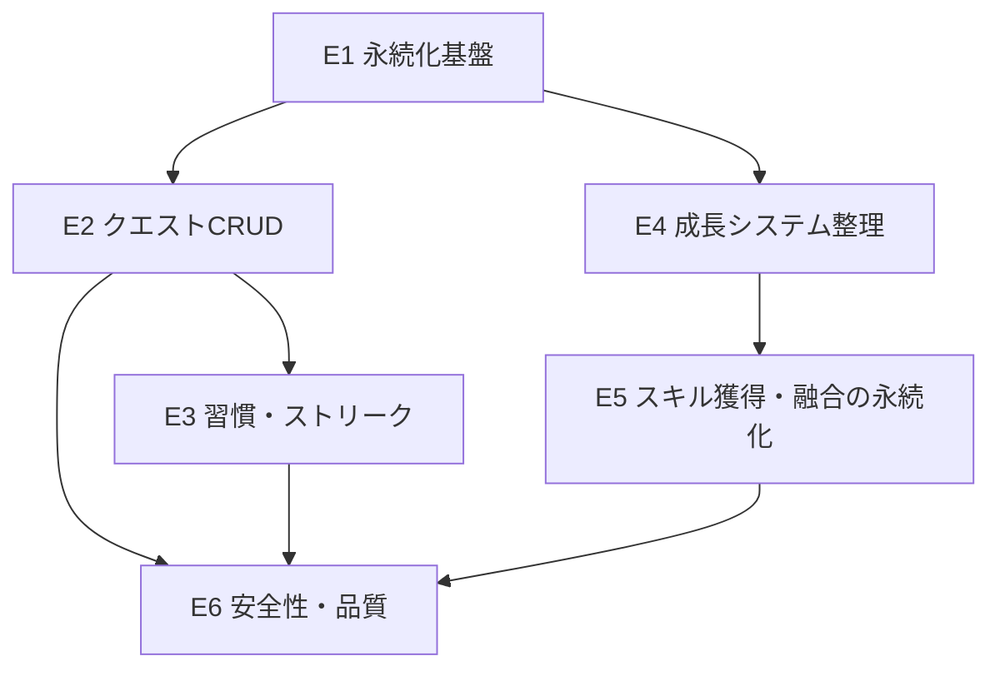

# LifeQuest 実装ストーリー（MVP / HTML強化路線）

> 出発点: 添付 `lifequest.html` を強化して「動くMVP」に到達させる。
> 設計書: [lifequest-design.md](lifequest-design.md) と整合。
> 形式: 各ストーリーは「ユーザーストーリー / 受け入れ条件（AC） / 技術タスク / 対象 / 見積り / 依存」。
> 見積り: S=半日, M=1日, L=2〜3日（目安）。

---

## エピック構成と実装順

実装順の推奨: **E1 → E2 → E3 → E4 → E5 → E6**
（E4 は E1 完了後いつでも着手可。E6 は各エピックに横断的に適用）

---

## E1. 永続化基盤

現状リロードで全消失。すべての成長要素が積み上がる前提なので最優先。

### S1-1. ゲーム状態のローカル保存・復元
- **ユーザーストーリー**: ユーザーとして、アプリを閉じて開き直しても、進捗（レベル/EXP/完了状態/スキル/ストリーク）が残っていてほしい。
- **受け入れ条件 (AC)**:
  1. クエスト完了・レベルアップ・スキル獲得・融合のたびに状態が保存される。
  2. リロード後、保存済みの LV/EXP/EXPバー/完了クエスト/スキル一覧/ストリークが復元される。
  3. 保存データが無い初回起動時は初期状態で正常に立ち上がる。
  4. 保存データが壊れている場合はエラーで落ちず、初期状態にフォールバックする。
- **技術タスク**:
  - 状態を単一オブジェクト `state`（`{version, LV, EXP, totalExpEarned, quests:[{id,done}], skills, fused, streak, lastActiveDate}`）に集約。
  - `saveState()` / `loadState()` を実装（まず `localStorage`、キー `lifequest:v1`）。
  - `version` フィールドを持たせ、将来のマイグレーションに備える。
  - 既存の各更新関数（`gainExp`/`toggle`/`finishFusion` 等）の末尾で `saveState()` を呼ぶ。
- **対象**: `lifequest.html`（script内）
- **見積り**: M
- **依存**: なし

### S1-2. RESET と保存の整合
- **ユーザーストーリー**: ユーザーとして、RESET したら保存データも初期化され、リロードしても初期状態のままであってほしい。
- **AC**:
  1. RESET 実行で保存データが初期化される（またはクリアされる）。
  2. RESET 後にリロードしても初期状態が維持される。
  3. RESET 前に確認（トースト or 簡易確認）があり、誤操作で消えにくい。
- **技術タスク**: `resetBtn` ハンドラで `saveState()`（初期値）または `localStorage.removeItem`。確認UIの付与。
- **対象**: `lifequest.html`
- **見積り**: S
- **依存**: S1-1

---

## E2. クエスト CRUD

現状クエストはハードコード配列。ユーザーが自分のタスクを管理できるようにする。

### S2-1. クエストの追加
- **ユーザーストーリー**: ユーザーとして、自分のタスクをクエストとして追加したい。
- **AC**:
  1. 「＋追加」操作で入力モーダル（平行四辺形・黒地白文字・skew準拠）が開く。
  2. 入力項目: タスク名（必須）/ 種別（DAILY 等）/ 獲得EXP / ボス属性（ON時はスキル名入力）。
  3. 保存するとクエスト一覧の末尾に追加され、残数カウントが更新される。
  4. 追加内容は永続化され、リロード後も残る。
  5. タスク名が空のときは保存できない（バリデーション）。
- **技術タスク**:
  - モーダルコンポーネント（HTML+CSS、デザインシステム準拠）。
  - `QUESTS` を可変データ化（id採番）。`addQuest()` 実装＋再描画＋保存。
- **対象**: `lifequest.html`
- **見積り**: M
- **依存**: S1-1

### S2-2. クエストの編集・削除
- **ユーザーストーリー**: ユーザーとして、登録済みクエストを編集・削除したい。
- **AC**:
  1. 各クエストから編集を開くと既存値がプリセットされたモーダルが開く。
  2. 編集保存で内容が反映され、永続化される。
  3. 削除は確認のうえ実行され、一覧と残数から消える。
  4. 完了済みクエストの編集/削除時、EXPやステータスの再計算が破綻しない（仕様を明記：完了済みの編集はEXPに影響しない等）。
- **技術タスク**: `editQuest()` / `deleteQuest()`、長押し or メニューボタンのUI、再描画・保存。
- **対象**: `lifequest.html`
- **見積り**: M
- **依存**: S2-1

### S2-3. 完了の取り消し（任意）
- **ユーザーストーリー**: ユーザーとして、誤って完了にしたクエストを未完了に戻したい。
- **AC**:
  1. 完了クエストを再操作すると未完了へ戻る（設定で有効/無効を選べると尚良し）。
  2. 取り消し時に付与済みEXPが正しく差し引かれ、レベル/ステータスが整合する。
  3. ボススキルを既に獲得済みの場合の扱いを定義（例: スキルは保持／別途確認）。
- **技術タスク**: `toggle()` を双方向化、EXP/`totalExpEarned` の逆算ロジック、レベルダウン境界の処理。
- **対象**: `lifequest.html`
- **見積り**: M
- **依存**: S2-1, E4

---

## E3. 習慣・ストリーク

現状ストリークは静的表示。習慣タスクの繰り返しと連続記録を実装。

### S3-1. デイリー（習慣）クエストの自動リセット
- **ユーザーストーリー**: ユーザーとして、毎日やる習慣クエストが翌日には自動で未完了に戻ってほしい。
- **AC**:
  1. クエストに「習慣（リピート）」属性を設定できる。
  2. 起動時、ローカル日付が前回から変わっていれば習慣クエストの `done` をリセットする。
  3. 非習慣（単発）クエストはリセットされない。
  4. 日付判定はローカルタイムゾーン基準で、日跨ぎでも正しく動く。
- **技術タスク**: `repeat_rule`/`is_habit` 追加、起動時 `rolloverIfNewDay()`、`lastActiveDate` 比較。
- **対象**: `lifequest.html`
- **見積り**: M
- **依存**: S1-1, S2-1

### S3-2. ストリーク（連続達成日数）の記録
- **ユーザーストーリー**: ユーザーとして、毎日タスクをこなした連続日数が炎アイコンで増えていくのを見たい。
- **AC**:
  1. その日に1つ以上クエストを完了した日を「達成日」とカウント。
  2. 連続した達成日でストリークが増加し、1日でも未達成だとリセットされる。
  3. ストリーク値はヘッダーの炎（マゼンタ）に反映され、永続化される。
- **技術タスク**: 達成日判定、`streak_count` 更新、`rolloverIfNewDay()` との連動。
- **対象**: `lifequest.html`
- **見積り**: M
- **依存**: S3-1

---

## E4. 成長システム整理

既存ロジックを永続化・テスト可能な形に整理（EXP曲線のデータ駆動化）。

### S4-1. EXP / レベルロジックのデータ駆動化
- **ユーザーストーリー**: 開発者として、EXP曲線や報酬を設定で調整できるようにし、バランス調整を容易にしたい。
- **AC**:
  1. レベルごとの必要EXP（現状固定500）を設定/関数で定義できる。
  2. レベルアップ・複数レベル同時アップが正しく処理される。
  3. `totalExpEarned` による成長値（GROWTH）属性が正しく反映される。
- **技術タスク**: `expForLevel(level)` 抽出、`gainExp` のリファクタ、設定オブジェクト化。
- **対象**: `lifequest.html`
- **見積り**: S
- **依存**: なし（S1-1後が望ましい）

---

## E5. スキル獲得・融合の永続化と整理

演出は実装済み。状態保存と融合レシピのデータ駆動化を行う。

### S5-1. スキル獲得・融合状態の永続化
- **ユーザーストーリー**: ユーザーとして、獲得したスキルや融合した上位スキルがリロード後も残ってほしい。
- **AC**:
  1. ボス討伐で得たスキル、融合済みフラグが保存・復元される。
  2. 復元後もステータス画面のスキル一覧・称号・GOT数が正しく表示される。
  3. 融合ボタンの有効/無効状態が復元後も正しい。
- **技術タスク**: `skills`/`fused` を保存対象に含める、復元時の `renderSkills`/`checkFuseReady` 呼び出し。
- **対象**: `lifequest.html`
- **見積り**: S
- **依存**: S1-1

### S5-2. 融合レシピのデータ駆動化
- **ユーザーストーリー**: 開発者として、融合レシピ（素材→結果）を設定で追加・変更できるようにしたい。
- **AC**:
  1. レシピ（素材スキル集合・結果スキル・報酬EXP）を配列で定義できる。
  2. 揃ったレシピがあれば融合ボタンが有効になり、対応する結果が生成される。
  3. 将来複数レシピに拡張しても破綻しない構造になっている。
- **技術タスク**: `FUSE_RECIPE` を配列化、判定ロジックの一般化、演出の結果名差し込み。
- **対象**: `lifequest.html`
- **見積り**: M
- **依存**: S5-1

---

## E6. 安全性・品質（横断）

### S6-1. ユーザー入力のエスケープ（XSS対策）
- **ユーザーストーリー**: 利用者として、自分が入力したタスク名が安全に表示され、アプリが壊れたり危険な動作をしたりしないでほしい。
- **AC**:
  1. タスク名・スキル名など全ユーザー入力が `<`,`>`,`&` 等を含んでも安全に表示される。
  2. `innerHTML` 直挿しをやめる、または確実にエスケープする。
- **技術タスク**: `escapeHtml()` 導入 or `textContent`/要素生成への置換。
- **対象**: `lifequest.html`
- **見積り**: S
- **依存**: S2-1（入力導入と同時に必須）

### S6-2. 主要ロジックの検証
- **ユーザーストーリー**: 開発者として、EXP/レベル/ストリーク/融合の計算が正しいと確信したい。
- **AC**:
  1. EXP加算→レベルアップ、完了取消→逆算、日跨ぎリセット、ストリーク増減の主要ケースを手動テスト手順書 or 簡易テストで確認。
  2. `prefers-reduced-motion` で演出が短縮される。
- **技術タスク**: 純粋関数化した成長ロジックを切り出し、最小テスト or チェックリスト整備。
- **対象**: `lifequest.html`（将来 React化時に自動テスト移行）
- **見積り**: M
- **依存**: E4, E3, E5

---

## E7. クリスタル経済（拡張レイヤー第一歩）

拡張設計（[lifequest-design-expansion.md](lifequest-design-expansion.md)）の起点。現実のタスク消化でガチャ資源「クリスタル」を稼ぐ実感を作る。バトル/ガチャ本体より先に「貯まる手応え」を出す。

### S7-1. クリスタル付与ロジック＋永続化
- **ユーザーストーリー**: ユーザーとして、タスクをこなすほどクリスタルが貯まり、現実の行動がゲーム資源になる実感がほしい。
- **受け入れ条件 (AC)**:
  1. クエスト完了でクリスタルを獲得する（通常=+5 / BOSS=+30）。
  2. 融合成功で +50、レベルアップで +20（レベルごと）を獲得する。
  3. その日の最初の達成（ストリーク加算時）に「連続日数×2」のボーナスを獲得する。
  4. 付与量は設定オブジェクト（`CRYSTAL_CONFIG`）で外出しし、調整可能。
  5. クリスタル所持数は永続化され、リロード後も維持。RESET で 0 に戻る。
- **技術タスク**: `crystals` 状態＋`gainCrystals()`、`toggle`/`gainExp`/`finishFusion`/ストリーク加算へフック、serialize/apply/reset 対応。
- **対象**: `index.html`
- **見積り**: M / **依存**: コア（E3,E4,E5）

### S7-2. クリスタル所持数の表示＋獲得フィードバック
- **ユーザーストーリー**: ユーザーとして、今いくつクリスタルを持っているか一目で分かり、増えた瞬間が気持ちよく感じたい。
- **AC**:
  1. ヘッダーにクリスタル所持数を常時表示（Solid Pop 準拠・シアン系で EXP/ストリークと区別）。
  2. 獲得時に数値が更新され、チップが一瞬パルスする等のフィードバックがある。
  3. 通常クエスト完了トーストに獲得クリスタルを併記。
- **技術タスク**: ヘッダーにクリスタルチップ追加、`updateCrystalDisplay()`、パルス演出、トースト文言更新。
- **対象**: `index.html`
- **見積り**: S / **依存**: S7-1

---

## E8. ガチャ＆お供キャラ

クリスタル（E7）を消費してお供キャラを召喚する。現実の達成で貯めた資源が「収集の楽しさ」に変わる接続点。

### S8-1. お供マスタ＋ガチャ抽選ロジック
- **ユーザーストーリー**: ユーザーとして、貯めたクリスタルでガチャを回し、レアリティのあるお供キャラを入手したい。
- **受け入れ条件 (AC)**:
  1. お供マスタ（`COMPANION_DEFS`：id/名前/レアリティ★3-5/属性/役割）を定義。
  2. 排出レート（★5:3% / ★4:22% / ★3:75%）に従い抽選。確率は設定で外出し。
  3. 単発（50）／10連（450）。クリスタル不足時は実行不可。
  4. **天井**: ★5が出ないまま規定回数（100）で★5確定。カウンタは永続化。
  5. **10連保証**: 10連で★4以上が最低1体。
  6. ダブりは所持数として加算（覚醒素材化は将来 E13）。
- **対象**: `index.html` / **見積り**: M / **依存**: E7

### S8-2. ガチャ画面・召喚演出・コレクション＋永続化
- **ユーザーストーリー**: ユーザーとして、召喚の瞬間が気持ちよく、何を持っているか一覧で見たい。
- **AC**:
  1. GACHA タブを追加（クリスタル残高・単発/10連ボタン・所持コレクション）。
  2. 召喚演出（ソリッド演出流用）でレアリティ別に強度を変え、★5は特別感。NEW表示。
  3. 入手したお供は所持コレクションに反映され、永続化（リロード後も保持）。RESETで初期化。
  4. 世界観（Extreme Action & Solid Pop）に準拠。
- **対象**: `index.html` / **見積り**: M / **依存**: S8-1

---

## E10. メインキャラ＆スキル→技

メインキャラ＝自分。タスクで得たスキルを**バトルのアクティブ技**に変換し、装備できるようにする。「自分のスキルがそのまま戦力になる」手応えを、バトル本体(E11)に先立って作る。

### S10-1. メインキャラ定義＋スキル→技マッピング
- **ユーザーストーリー**: ユーザーとして、自分のレベルやスキルがバトル用のステータス・技として意味を持つのを見たい。
- **受け入れ条件 (AC)**:
  1. メインキャラのステータス（HP/ATK/SPD）を**ユーザーLVから算出**（`PROGRESS.level` と同期、二重管理しない）。
  2. 各スキルを技ステータス（威力/CT/属性/効果）へ変換（`SKILL_BATTLE` データ駆動、固有=通常技 / 融合=必殺）。
  3. 未知スキル（独自BOSS）の場合も kind に応じた既定値でフォールバック。
- **対象**: `index.html` / **見積り**: M / **依存**: コア（スキル/LV）

### S10-2. 技スロット装備UI（STATUSに統合）＋永続化
- **ユーザーストーリー**: ユーザーとして、獲得スキルから最大4つを技スロットに装備し、編成の準備をしたい。
- **AC**:
  1. STATUS画面に「MAIN CHARACTER」（ステータス＋技スロット4枠）を表示。
  2. 各スキルに技ステータスを表示し、装備/解除できる（最大4、満杯時は通知）。
  3. スキル獲得・融合時、空きがあれば自動装備。
  4. 装備状態は永続化（リロード後も保持）。RESETで初期化。未所持スキルは装備から除外（整合）。
  5. 新タブは増やさず STATUS に統合（モバイルのナビを簡潔に保つ）。
- **対象**: `index.html` / **見積り**: M / **依存**: S10-1

---

## E9. 図鑑＆編成

収集（E8）したお供を一望し、メインキャラ＋お供でチームを組む。バトル(E11)の準備層。

### S9-1. 図鑑（コレクション強化）
- **AC**:
  1. 全お供を一覧表示。未所持はロック（???）表示で「集める動機」を作る。
  2. 所持数 X / 全Y種、レアリティ色で区別。GACHA タブに配置。
- **対象**: `index.html` / **見積り**: S / **依存**: E8

### S9-2. チーム編成
- **ユーザーストーリー**: ユーザーとして、メインキャラ＋お供でパーティを組み、バトルに備えたい。
- **AC**:
  1. 1チーム＝メインキャラ（固定）＋お供スロット2（Phase1は3体編成）。
  2. 所持お供から各スロットに割当/解除できる。同一個体の重複編成は不可。
  3. 編成は永続化（リロード後も保持）。未所持は自動除外。RESETで初期化。
- **対象**: `index.html` / **見積り**: M / **依存**: E8

---

## E11. バトル Phase1（軽量ターン制）

編成したチームでステージに挑む。Phase1は HP/ATK/SPD のみ・速度順・自動解決。

### S11-1. バトル基盤
- **AC**:
  1. お供のバトルステータスをレアリティから算出。メインキャラは LV ステータス＋装備技で攻撃力に補正。
  2. ステージ定義（敵チーム・難易度・初回クリア報酬）。
  3. ターン制自動解決（SPD順に行動、ダメージ計算、全滅で決着、最大ラウンドで打切り）。勝敗を返す。
  4. 初回クリアでクリスタル報酬（経済保全のため一回限り、`clearedStages` 永続化）。再戦は報酬なしで周回可。
- **対象**: `index.html` / **見積り**: L / **依存**: S9-2, E10

### S11-2. バトルUI
- **AC**:
  1. BATTLE タブを追加（編成＋ステージ選択）。
  2. バトル画面: 自軍/敵軍のHPバー、ターンログが順次進行、勝敗結果と報酬表示。
  3. 世界観（Extreme Action & Solid Pop）準拠。reduced-motion で短縮。
- **対象**: `index.html` / **見積り**: L / **依存**: S11-1

---

## E12. バトル Phase2（スキルCT・属性相性）

Phase1の自動バトルに戦術性を追加。属性相性とスキルのクールタイム（CT）でチーム編成と装備技に意味を持たせる。

### S12-1. 属性相性
- **AC**:
  1. 属性相性: 火▶風▶土▶水▶火 の循環＋光⇆闇 の相互。有利=1.5倍 / 不利=0.75倍 / それ以外=等倍。無属性は常に等倍。
  2. 攻撃時、攻撃側属性 vs 対象属性で倍率を適用。ログに「効果抜群！/いまひとつ」を表示。
- **対象**: `index.html` / **見積り**: M / **依存**: E11

### S12-2. スキルCT（クールタイム）
- **AC**:
  1. 各ユニットはスキルを持ち、使用後CTが回復するまで通常攻撃。CT明けに最も威力の高いスキルを使用。
  2. メインキャラは装備技（固有=技/融合=必殺、各CT）、お供はレアリティ依存のスキル、敵は通常攻撃。
  3. スキル使用時は属性が乗り、ログに技名を表示。
- **対象**: `index.html` / **見積り**: M / **依存**: S12-1

### S12-3. バトルUI拡張
- **AC**:
  1. 各ユニットに属性タグを表示。相性結果をログに反映。
  2. BATTLE画面に属性相性の凡例を表示。
- **対象**: `index.html` / **見積り**: S / **依存**: S12-2

---

## E13. 育成 Phase3（タイムログ・ダンジョン／レベル／ルーン）

「現実の集中時間＝ダンジョン探索」。タスクに取り組んだ分を記入すると探索とみなし、時間分のドロップ（育成素材）を得る。ドロップでお供を強化する。

### S13-1. タイムログ・ダンジョン → ドロップ
- **ユーザーストーリー**: ユーザーとして、タスクに集中した時間を記入すると、その分だけ育成素材がもらえるようにしたい。
- **AC**:
  1. 集中した分（1〜600）を手動入力して「探索」すると、時間に比例してドロップ（強化石＋ルーン）を得る。
  2. ドロップ量は設定で外出し（例: 強化石=5分に1、ルーン=30分に約1）。
  3. 所持（強化石・ルーン）を表示。永続化、RESETで初期化。
- **対象**: `index.html` / **見積り**: M / **依存**: E11

### S13-2. お供レベルアップ（強化石）
- **AC**:
  1. 強化石を消費してお供をレベルアップ（上限あり）。レベルでHP/ATK/SPDが上昇しバトルに反映。
  2. コストはレベルに応じて増加。永続化。
- **対象**: `index.html` / **見積り**: M / **依存**: S13-1

### S13-3. ルーン装備
- **AC**:
  1. ルーンはHP/ATK/SPDのいずれかを補正する装備。各ユニット（メイン＋お供）に最大2個装備。
  2. 装備/解除でき、バトルステータスに反映。永続化。
- **対象**: `index.html` / **見積り**: M / **依存**: S13-1

---

## E15. タスク自動分類（ヒューリスティック土台・AI差し替え可能）

ユーザーがEXPやスキル獲得を手入力するのをやめ、システムが自動算出する。知識の自動体系化PRD（断片メモ→動的オントロジーで既存タグへルーティング、タグ爆発防止、低信頼は未承認Inbox）の考え方を踏襲。AI（WebLLM/Ollama/クラウド）は後から差し替え可能にする。

### S15-1. 分類インターフェース＋ルールベース実装
- **AC**:
  1. `classifyTask(本文, 意図) → { exp, tags[], confidence }` の差し替え可能なインターフェースを定義。
  2. 既定はオフラインで動くルールベース近似（難易度語・文量→EXP、既存タグ集合＝動的オントロジーへのキーワードマッチ）。
  3. 新規タグは原則作らず既存にルーティング。全く未知の概念のときのみ1つだけ新規許可。
  4. AIバックエンド（A:WebLLM / B:Ollama / C:クラウド）を後から差すだけにする。
- **対象**: `index.html` / **見積り**: M / **依存**: E2

### S15-2. 追加UXの簡素化＋未承認Inbox
- **ユーザーストーリー**: ユーザーとして、EXPやスキルを自分で決めず、本文とざっくりした意図だけ書けばよくしたい。
- **AC**:
  1. 追加は「本文（必須）＋ざっくり意図（任意・単語可）＋難易度（任意）」中心。EXPの数値手入力は撤廃し自動算出。
  2. BOSS/スキル等の細かい指定は「詳細設定」に格納（任意・既定では触らない）。
  3. 意図が空、または信頼度が低い場合は `#未承認` として Inbox に隔離。後でワンタップ承認/修正でネットワークへ合流。
  4. 付与タグ・自動EXPはクエストに保存され永続化。
- **対象**: `index.html` / **見積り**: M / **依存**: S15-1

### S15-3.（次段）カテゴリ習熟→スキル自動付与
- カテゴリ別の累計完了でテーマスキルを自動解放し、スキル名の手入力を撤廃。既存スキル名（融合レシピ）との整合を保つ設計を別途行う。**※融合・バトル資産を壊さないため独立ステップ。**

---

## 将来バックログ（保留・着手未定）

### リッチ化（Web継続のまま・後回し）
- Unityは見送り（習慣アプリの手軽さ・配布・開発速度を優先）。リッチ化はWeb技術で行う。
- 候補: 効果音/BGM（Howler.js）→ バトル演出強化（GSAP / Canvas / PixiJS で斬撃・ダメージ・パーティクル）→ Lottie/Spineでキャラ動き。
- ネイティブ配布・プッシュ通知が必要になったら Capacitor でPWAをラップ（Unity化はしない）。
- ※ゲームが主役へピボットする決断をした場合のみ Unity/Godot を再検討。

---

## 最初のスプリント提案

| 順 | ストーリー | 見積り |
| :-- | :--- | :--- |
| 1 | S1-1 ゲーム状態の保存・復元 | M |
| 2 | S1-2 RESET と保存の整合 | S |
| 3 | S2-1 クエストの追加 | M |
| 4 | S6-1 入力エスケープ（S2-1と同時） | S |
| 5 | S2-2 編集・削除 | M |

> まず S1-1 から実装に入るのを推奨。
