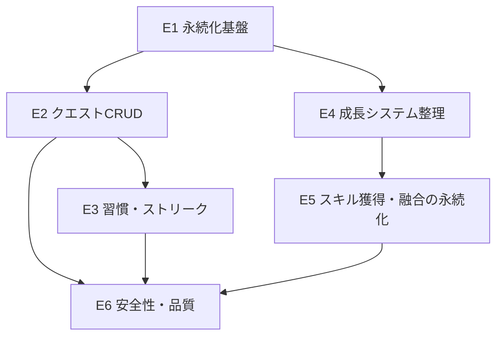

# LifeQuest 実装ストーリー（MVP / HTML強化路線）

> 出発点: 添付 `lifequest.html` を強化して「動くMVP」に到達させる。
> 設計書: [lifequest-design.md](lifequest-design.md) と整合。
> 形式: 各ストーリーは「ユーザーストーリー / 受け入れ条件（AC） / 技術タスク / 対象 / 見積り / 依存」。
> 見積り: S=半日, M=1日, L=2〜3日（目安）。

---

## エピック構成と実装順

実装順の推奨: **E1 → E2 → E3 → E4 → E5 → E6**
（E4 は E1 完了後いつでも着手可。E6 は各エピックに横断的に適用）

---

## E1. 永続化基盤

現状リロードで全消失。すべての成長要素が積み上がる前提なので最優先。

### S1-1. ゲーム状態のローカル保存・復元
- **ユーザーストーリー**: ユーザーとして、アプリを閉じて開き直しても、進捗（レベル/EXP/完了状態/スキル/ストリーク）が残っていてほしい。
- **受け入れ条件 (AC)**:
  1. クエスト完了・レベルアップ・スキル獲得・融合のたびに状態が保存される。
  2. リロード後、保存済みの LV/EXP/EXPバー/完了クエスト/スキル一覧/ストリークが復元される。
  3. 保存データが無い初回起動時は初期状態で正常に立ち上がる。
  4. 保存データが壊れている場合はエラーで落ちず、初期状態にフォールバックする。
- **技術タスク**:
  - 状態を単一オブジェクト `state`（`{version, LV, EXP, totalExpEarned, quests:[{id,done}], skills, fused, streak, lastActiveDate}`）に集約。
  - `saveState()` / `loadState()` を実装（まず `localStorage`、キー `lifequest:v1`）。
  - `version` フィールドを持たせ、将来のマイグレーションに備える。
  - 既存の各更新関数（`gainExp`/`toggle`/`finishFusion` 等）の末尾で `saveState()` を呼ぶ。
- **対象**: `lifequest.html`（script内）
- **見積り**: M
- **依存**: なし

### S1-2. RESET と保存の整合
- **ユーザーストーリー**: ユーザーとして、RESET したら保存データも初期化され、リロードしても初期状態のままであってほしい。
- **AC**:
  1. RESET 実行で保存データが初期化される（またはクリアされる）。
  2. RESET 後にリロードしても初期状態が維持される。
  3. RESET 前に確認（トースト or 簡易確認）があり、誤操作で消えにくい。
- **技術タスク**: `resetBtn` ハンドラで `saveState()`（初期値）または `localStorage.removeItem`。確認UIの付与。
- **対象**: `lifequest.html`
- **見積り**: S
- **依存**: S1-1

---

## E2. クエスト CRUD

現状クエストはハードコード配列。ユーザーが自分のタスクを管理できるようにする。

### S2-1. クエストの追加
- **ユーザーストーリー**: ユーザーとして、自分のタスクをクエストとして追加したい。
- **AC**:
  1. 「＋追加」操作で入力モーダル（平行四辺形・黒地白文字・skew準拠）が開く。
  2. 入力項目: タスク名（必須）/ 種別（DAILY 等）/ 獲得EXP / ボス属性（ON時はスキル名入力）。
  3. 保存するとクエスト一覧の末尾に追加され、残数カウントが更新される。
  4. 追加内容は永続化され、リロード後も残る。
  5. タスク名が空のときは保存できない（バリデーション）。
- **技術タスク**:
  - モーダルコンポーネント（HTML+CSS、デザインシステム準拠）。
  - `QUESTS` を可変データ化（id採番）。`addQuest()` 実装＋再描画＋保存。
- **対象**: `lifequest.html`
- **見積り**: M
- **依存**: S1-1

### S2-2. クエストの編集・削除
- **ユーザーストーリー**: ユーザーとして、登録済みクエストを編集・削除したい。
- **AC**:
  1. 各クエストから編集を開くと既存値がプリセットされたモーダルが開く。
  2. 編集保存で内容が反映され、永続化される。
  3. 削除は確認のうえ実行され、一覧と残数から消える。
  4. 完了済みクエストの編集/削除時、EXPやステータスの再計算が破綻しない（仕様を明記：完了済みの編集はEXPに影響しない等）。
- **技術タスク**: `editQuest()` / `deleteQuest()`、長押し or メニューボタンのUI、再描画・保存。
- **対象**: `lifequest.html`
- **見積り**: M
- **依存**: S2-1

### S2-3. 完了の取り消し（任意）
- **ユーザーストーリー**: ユーザーとして、誤って完了にしたクエストを未完了に戻したい。
- **AC**:
  1. 完了クエストを再操作すると未完了へ戻る（設定で有効/無効を選べると尚良し）。
  2. 取り消し時に付与済みEXPが正しく差し引かれ、レベル/ステータスが整合する。
  3. ボススキルを既に獲得済みの場合の扱いを定義（例: スキルは保持／別途確認）。
- **技術タスク**: `toggle()` を双方向化、EXP/`totalExpEarned` の逆算ロジック、レベルダウン境界の処理。
- **対象**: `lifequest.html`
- **見積り**: M
- **依存**: S2-1, E4

---

## E3. 習慣・ストリーク

現状ストリークは静的表示。習慣タスクの繰り返しと連続記録を実装。

### S3-1. デイリー（習慣）クエストの自動リセット
- **ユーザーストーリー**: ユーザーとして、毎日やる習慣クエストが翌日には自動で未完了に戻ってほしい。
- **AC**:
  1. クエストに「習慣（リピート）」属性を設定できる。
  2. 起動時、ローカル日付が前回から変わっていれば習慣クエストの `done` をリセットする。
  3. 非習慣（単発）クエストはリセットされない。
  4. 日付判定はローカルタイムゾーン基準で、日跨ぎでも正しく動く。
- **技術タスク**: `repeat_rule`/`is_habit` 追加、起動時 `rolloverIfNewDay()`、`lastActiveDate` 比較。
- **対象**: `lifequest.html`
- **見積り**: M
- **依存**: S1-1, S2-1

### S3-2. ストリーク（連続達成日数）の記録
- **ユーザーストーリー**: ユーザーとして、毎日タスクをこなした連続日数が炎アイコンで増えていくのを見たい。
- **AC**:
  1. その日に1つ以上クエストを完了した日を「達成日」とカウント。
  2. 連続した達成日でストリークが増加し、1日でも未達成だとリセットされる。
  3. ストリーク値はヘッダーの炎（マゼンタ）に反映され、永続化される。
- **技術タスク**: 達成日判定、`streak_count` 更新、`rolloverIfNewDay()` との連動。
- **対象**: `lifequest.html`
- **見積り**: M
- **依存**: S3-1

---

## E4. 成長システム整理

既存ロジックを永続化・テスト可能な形に整理（EXP曲線のデータ駆動化）。

### S4-1. EXP / レベルロジックのデータ駆動化
- **ユーザーストーリー**: 開発者として、EXP曲線や報酬を設定で調整できるようにし、バランス調整を容易にしたい。
- **AC**:
  1. レベルごとの必要EXP（現状固定500）を設定/関数で定義できる。
  2. レベルアップ・複数レベル同時アップが正しく処理される。
  3. `totalExpEarned` による成長値（GROWTH）属性が正しく反映される。
- **技術タスク**: `expForLevel(level)` 抽出、`gainExp` のリファクタ、設定オブジェクト化。
- **対象**: `lifequest.html`
- **見積り**: S
- **依存**: なし（S1-1後が望ましい）

---

## E5. スキル獲得・融合の永続化と整理

演出は実装済み。状態保存と融合レシピのデータ駆動化を行う。

### S5-1. スキル獲得・融合状態の永続化
- **ユーザーストーリー**: ユーザーとして、獲得したスキルや融合した上位スキルがリロード後も残ってほしい。
- **AC**:
  1. ボス討伐で得たスキル、融合済みフラグが保存・復元される。
  2. 復元後もステータス画面のスキル一覧・称号・GOT数が正しく表示される。
  3. 融合ボタンの有効/無効状態が復元後も正しい。
- **技術タスク**: `skills`/`fused` を保存対象に含める、復元時の `renderSkills`/`checkFuseReady` 呼び出し。
- **対象**: `lifequest.html`
- **見積り**: S
- **依存**: S1-1

### S5-2. 融合レシピのデータ駆動化
- **ユーザーストーリー**: 開発者として、融合レシピ（素材→結果）を設定で追加・変更できるようにしたい。
- **AC**:
  1. レシピ（素材スキル集合・結果スキル・報酬EXP）を配列で定義できる。
  2. 揃ったレシピがあれば融合ボタンが有効になり、対応する結果が生成される。
  3. 将来複数レシピに拡張しても破綻しない構造になっている。
- **技術タスク**: `FUSE_RECIPE` を配列化、判定ロジックの一般化、演出の結果名差し込み。
- **対象**: `lifequest.html`
- **見積り**: M
- **依存**: S5-1

---

## E6. 安全性・品質（横断）

### S6-1. ユーザー入力のエスケープ（XSS対策）
- **ユーザーストーリー**: 利用者として、自分が入力したタスク名が安全に表示され、アプリが壊れたり危険な動作をしたりしないでほしい。
- **AC**:
  1. タスク名・スキル名など全ユーザー入力が `<`,`>`,`&` 等を含んでも安全に表示される。
  2. `innerHTML` 直挿しをやめる、または確実にエスケープする。
- **技術タスク**: `escapeHtml()` 導入 or `textContent`/要素生成への置換。
- **対象**: `lifequest.html`
- **見積り**: S
- **依存**: S2-1（入力導入と同時に必須）

### S6-2. 主要ロジックの検証
- **ユーザーストーリー**: 開発者として、EXP/レベル/ストリーク/融合の計算が正しいと確信したい。
- **AC**:
  1. EXP加算→レベルアップ、完了取消→逆算、日跨ぎリセット、ストリーク増減の主要ケースを手動テスト手順書 or 簡易テストで確認。
  2. `prefers-reduced-motion` で演出が短縮される。
- **技術タスク**: 純粋関数化した成長ロジックを切り出し、最小テスト or チェックリスト整備。
- **対象**: `lifequest.html`（将来 React化時に自動テスト移行）
- **見積り**: M
- **依存**: E4, E3, E5

---

## 最初のスプリント提案

| 順 | ストーリー | 見積り |
| :-- | :--- | :--- |
| 1 | S1-1 ゲーム状態の保存・復元 | M |
| 2 | S1-2 RESET と保存の整合 | S |
| 3 | S2-1 クエストの追加 | M |
| 4 | S6-1 入力エスケープ（S2-1と同時） | S |
| 5 | S2-2 編集・削除 | M |

> まず S1-1 から実装に入るのを推奨。
